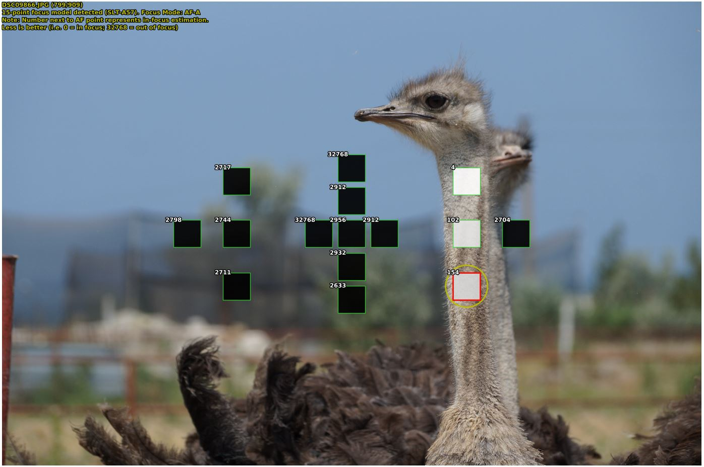

# Visualizer of AF data from Sony cameras JPEG and ARW (RAW) EXIFs

This tool allows to visualize some statuses of PDAF sensors or CAF stored in EXIF metadata of JPEGs and **RAW (ARW)** from Sony cameras. Auto focus statuses are parsed from EXIF and presented as ExifTool interprets them. 
I.e. this tool show where are focus points.

**Most recent standalone single file (extracts all libs and runtime to temp folder, no python installed required) Win x64 version download link (no exiftool.exe included)**
https://drive.google.com/open?id=1GMof0_uf2jwhjnz2dcmO6KQ3WGAs5cAH

**Most recent bundle (all libs and runtimes, no python installed required) Win x64 version download link (no exiftool.exe included)**
https://drive.google.com/open?id=1VEufaZKym2ps6J--KY2XKpTOAaeoFSF8

With this tool you can see:
- For SLT cameras with 15-points PDAF (SLT-A33, SLT-A55, SLT-A35, SLT-A65, SLT-A57, SLT-A58):
  - AF hit status for each sensor at shutter release. AF hit displayed by colors from black to white. Black = out of focus. White = In Focus
  - If Face Detection was on, and Face(s) detected - they are highlighted with red frame
  - What AF points were used for final focus adjustments (have additional RED frame)
  - What AF point was reported as in Focus (Yellow circle)

  
- For SLT cameras with 19-points PDAF (SLT-A77, SLT-A99):
  - AF hit status for each sensor at shutter release. AF hit displayed by colors from black to white. Black = out of focus. White = In Focus
  - If Face Detection was on, and Face(s) detected - they are highlighted with red frame
  
- For CAF cameras (for example, DSC-RX100M4, DSC-RX10M3 and many other older Cybershots)
  - If Face Detection was on, and Face(s) detected - they are highlighted with red frame
  - What area was reported as in Focus (Yellow circle). Actually what camera thinks it focused at.
  
- For Hybrid AF cameras (like ILCE-5100, ILCE-6000, ILCE-6300, ILCE-6500, ILCE-7RM2,ILCA-99M2, ILCA-77M2, ILCE-9, ILCE-7RM3, ILCE-7M3, DSC-RX100M6, DSC-RX10M4)
  - If Face Detection was on, and Face(s) detected - they are highlighted with red frame
  - What area was reported as in Focus (Yellow circle). Actually what camera thinks it focused at.
  - What Focal Plane (on-sensor) AF points were used
  - [ILCA-77M2, ILCA-99M2] Also Dedicated PDAF sensors statuses display
 
**Reads both JPEG/ARW**
  
This tool consists of:
  - afv.py - main script itself doing all drawing.
  - exiftool (should be downloaded separately (link below) and named as **exiftool.exe** and placed in the same folder as afv.py
  
  *Note: For easy use downloaded compiled already package)*
  
Prerequisities for launching source script:
  - Python 2.7
  - matplotlib module installed (pip install matplotlib) (http://matplotlib.org/). Warning
  - rawpy (pip install rawpy) to show ARW
  - pillow (pip install pillow) to load and show JPG
  - Phil Harvey's EXIFTool binary (named exiftool.exe) to be placed in the same folder as afv.py script. Exiftool download (http://www.sno.phy.queensu.ca/~phil/exiftool/)

Warning! You will get no results or corrupted results if you JPEG photos (their EXIF) were modified or by image processing software. So please use JPEGs straight from the camera.
